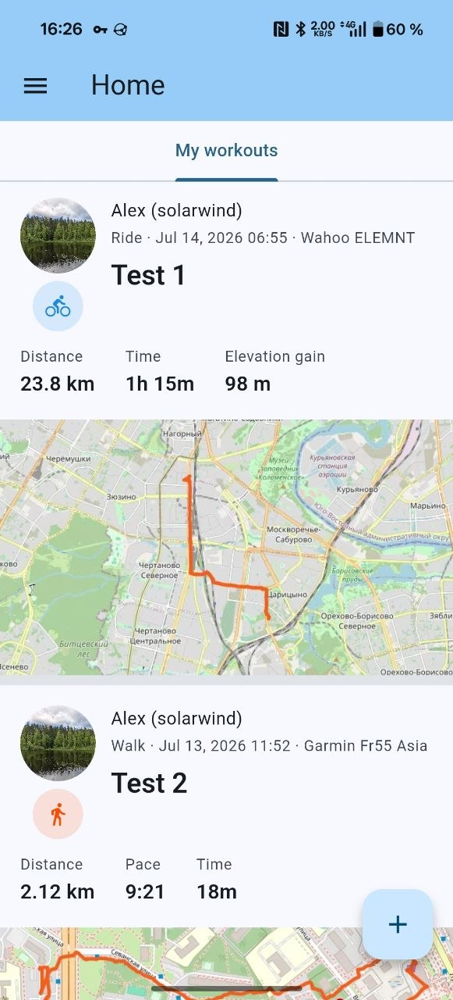
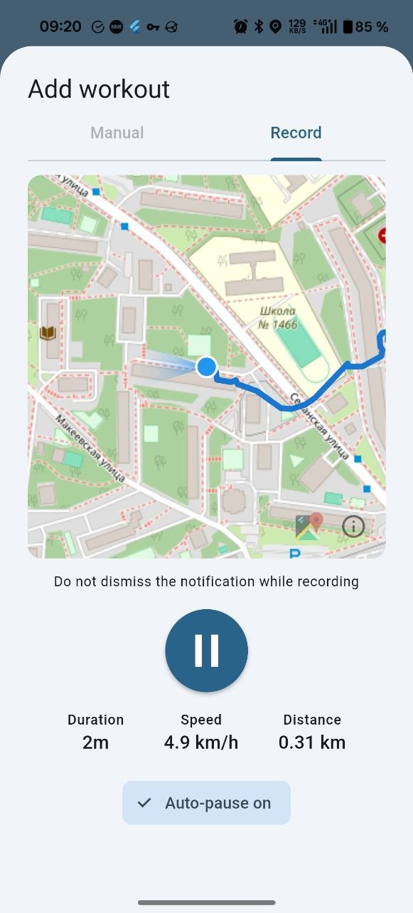
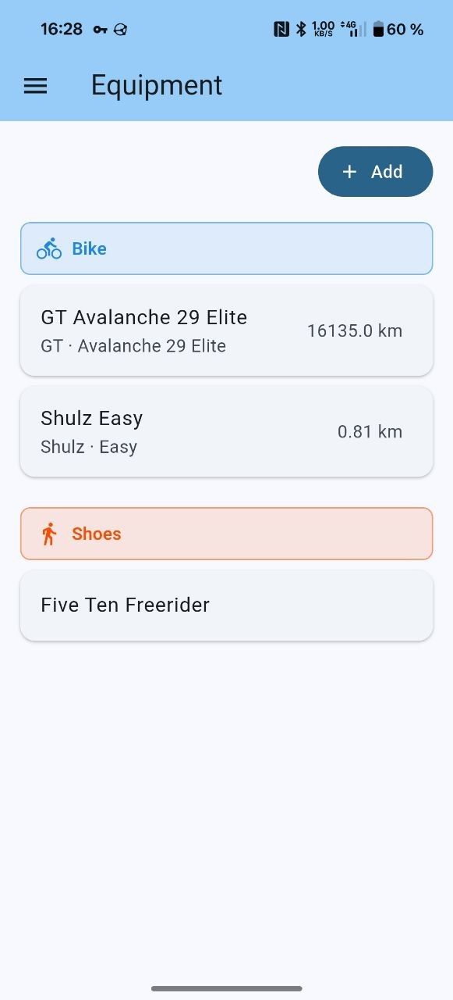

# Project Grom

> ⚠️ **Warning — early development**
>
> Grom is under active development and is closer to an MVP than production software. It is not ready for production use.
>
> Configuration formats, APIs, storage layouts, and other interfaces may and will change without a stable migration path. Expect bugs. Use at your own risk.

> **Grom — a free workout ecosystem: your server, your communities, open code.**

Grom aims to be a fully free ecosystem for athletes and enthusiasts: run a server for yourself or any community, keep workouts on infrastructure you control, and optionally share activities across communities through federation. It stays open to integrations with available sports services and formats — and remains open source so anyone can help shape it. Longer version: [About the project](docs/about.md).

Self-hosted workout tracker with an optional ActivityPub federation layer. Record or import workouts, manage equipment, follow other athletes (local or federated), like and comment on their activities, and browse a social feed — all on infrastructure you control.

The server is a single Go binary; the Flutter client ships as an embedded web UI and as an Android app.

## Features

- **Workouts** — create and edit activities with stats, notes, media, and map previews
- **GPS tracks** — import GPX and FIT; live recording on Android
- **Equipment** — track bikes, shoes, and other gear linked to workouts
- **Social feed** — follow users and see their workouts in one timeline
- **Workout likes** — like others’ activities, see counts and who liked; federated `Like` / `Undo` when ActivityPub is enabled
- **Workout comments** — comment on own or others’ activities (add/list/delete); federated `Create`/`Delete` Note when ActivityPub is enabled
- **Federation** — optional ActivityPub so instances can follow each other across the network
- **Strava import** — bulk-import a Strava data export ZIP
- **Health Sync** — import activities from Google Drive on Android (Health Sync exports)
- **API tokens** — scoped personal access tokens (`grom_pat_…`) for workouts and equipment
- **Clients** — same Flutter UI in the browser (served by the server) and as an Android APK
- **Locales** — English, Russian, and German in the Flutter UI

<p align="center">
  
  
  
</p>

## Quick start

```bash
make grom    # swagger + Flutter web + Go binary → cmd/grom/grom
cd cmd/grom && go run . --config config-examples/config.dev.notls.yaml
```

Set `auth.jwt_secret` in your config (required). Example profiles: `cmd/grom/config-examples/`.

Then open `http://localhost:8080/` for the web UI, or `http://localhost:8080/api/docs/` for Swagger API docs (default dev port).

## Documentation

**On the website:** [Docs](https://grom.solargate.team/) · [About](https://grom.solargate.team/about/) · [User overview](https://grom.solargate.team/user/overview/) · [Delete account](https://grom.solargate.team/user/delete-account/) · [Install](https://grom.solargate.team/admin/install/) · [Configuration](https://grom.solargate.team/admin/configuration/) · [Privacy](https://grom.solargate.team/privacy/)

**In the repository** (for contributors):

- **[Docs index](docs/README.md)** — user and admin guides
- [About the project](docs/about.md) — mission, pillars, and why Grom exists
- [User overview](docs/user/overview.md) — client screens (workouts, likes, comments, password reset, captcha, recording, equipment, Health Sync)
- [Approved Grom servers](docs/user/approved-servers.md) — Android server picker and how to list a public instance
- [Delete your Grom account](docs/user/delete-account.md) — how to permanently delete an account (web or Android)
- [Grom API tokens](docs/user/grom-api-tokens.md) — personal access tokens for scripts and external apps
- [Health Sync + Google Drive](docs/integrations/health-sync-google-drive.md) — Android import from Health Sync via Drive
- [Install and run](docs/admin/install.md) — build and start the server
- [Configuration](docs/admin/configuration.md) — TLS, storage, federation, logging, mailer / password reset, captcha
- [Privacy policy](docs/privacy.md)
- API docs — `/api/docs/` on a running server (OpenAPI sources in [`api/docs/`](api/docs/))

## License

GPL-3.0

## Donations

If you’d like to support development, see [DONATIONS.md](DONATIONS.md).
